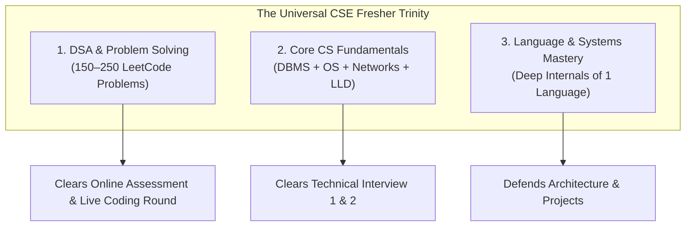
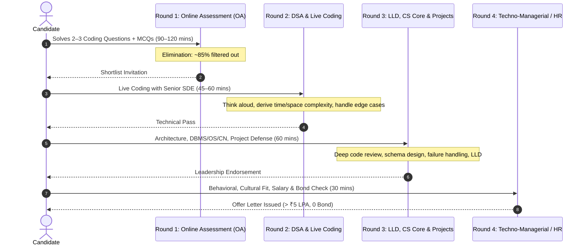

# 2026 B.Tech CSE Fresher "Must-Have Skills" & Hiring Pattern Blueprint
### *Target: > ₹4–5 LPA Compensation | Strict Zero-Employment-Bond Policy*

**Target Profile:** B.Tech Computer Science & Engineering (CSE) Graduate  
**Hiring Cycle:** August 2026 / FY27 Campus & Off-Campus Drives  
**Focus Geographies:** Chennai, Bangalore, Hyderabad, Pune, NCR + Remote  
**Data Sources:** Multi-channel analysis across `r/developersIndia`, LeetCode Discuss, Naukri Recruiter Filters, Instahyre, Wellfound (AngelList), Y Combinator Jobs, and verified placement post-mortems from Product Cos, GCCs, and Startups.

---

## 1. Executive Summary & The 2026 Fresher Hiring Reality

The Indian tech fresher hiring landscape in 2026 has undergone a fundamental structural split into two completely separate tiers:

```
                                 THE 2026 FRESHER MARKET BIFURCATION
                                                  │
                 ┌────────────────────────────────┴────────────────────────────────┐
                 ▼                                                                 ▼
    [TIER B: The Mass-Recruitment Trap]                                [TIER A: The Merit & Product Track]
    • Compensation: ₹3.2 – ₹4.0 LPA                                    • Compensation: ₹5.5 – ₹35+ LPA
    • 1 to 2-year service/employment bonds                             • STRICTLY ZERO BONDS
    • Mass aptitude tests + random role allocation                     • Rigorous DSA, Core CS, & Proof-of-Work
    • Support/Legacy maintenance risk                                  • Real product engineering, AI, & infra roles
    • (EXCLUDED FROM THIS ROADMAP)                                     • (TARGET OF THIS BLUEPRINT)
```

### The 3 Golden Rules of the 2026 Fresher Market:
1. **The Death of Tutorial Clones:** Generic MERN e-commerce clones, basic to-do apps, and standard Kaggle Titanic/Iris notebooks get zero ATS score and instant human rejection. Freshers getting ₹6–15 LPA offers demonstrate **systems thinking, live deployments, and measurable engineering trade-offs**.
2. **Job Descriptions are Wishlists, Not Checklists:** Recruiter JDs in 2026 routinely demand 2+ years of experience, Docker, Kubernetes, AWS, Kafka, Microservices, and PyTorch for entry-level titles. **You only need 60–70% of the core competencies** to get an interview.
3. **The Proof-of-Work Differentiator:** A single deployed full-stack or AI system with automated tests, clean architecture, and a live URL beats 10 half-baked repositories.

---

## 2. The Qualified "No-Bond" Company Landscape (> ₹4–5 LPA)

The following company tiers strictly meet the criteria of paying **> ₹4–5 LPA with ZERO employment bonds, zero bank guarantees, and standard corporate exit terms**:

| Tier | Category | Representative Companies | Typical Fresher CTC | Hiring Channels | Primary Gate |
|---|---|---|---|---|---|
| **Tier 1A** | **Chennai & Indian SaaS / Product Giants** | **Zoho**, **Freshworks**, **Chargebee**, **Kissflow**, **Mad Street Den / Vue.ai**, **Postman**, **Razorpay**, **Zerodha**, **Swiggy**, **Zomato** | **₹5.5 – ₹16 LPA** | Off-campus career portals, Hackathons, Referral DMs, Unstop | Advanced Coding / LLD (Zoho), DSA Medium + System Fundamentals |
| **Tier 1B** | **Global Capability Centers (GCCs)** | **Walmart Global Tech**, **Target India**, **Ford GTBC (Chennai)**, **Caterpillar**, **Standard Chartered GBS**, **PayPal (Chennai)**, **Fidelity**, **Cisco**, **Lowe's**, **Societe Generale** | **₹8 – ₹18 LPA** | Campus drives, Off-campus HackerEarth/HackerRank challenges, LinkedIn alumni referrals | Proctored OA (DSA) + Core CS (DBMS/OS/Networks) + SQL |
| **Tier 2** | **AI-First & Seed/Series A–B Startups** | Startups funded by Peak XV, Lightspeed, Accel, Y Combinator (via Wellfound, Peerlist, Instahyre) | **₹6 – ₹18 LPA** | Wellfound, YC Work at a Startup, Peerlist, Direct Founder / CTO cold DMs | Practical Take-Home Project, Live Architecture Discussion, GitHub deep-dive |
| **Tier 3** | **Merit-Based High-Package Service Tracks** | **TCS Digital** (₹7–7.5L), **TCS Prime** (₹9–11.5L), **Infosys Specialist Programmer - SP** (₹9.5–21L), **Infosys DSE** (₹6.25L), **Cognizant GenC Next** (₹6.75L) | **₹6.25 – ₹11.5 LPA** | TCS NQT (National Qualifier Test), Infosys HackWithInfy / InfyTQ, Campus merit tests | Hard Competitive Programming OA (Codeforces 1400–1800+ level) |
| **Tier 4** | **Global Tech / BigTech Tier** | **Google**, **Microsoft**, **Amazon**, **Atlassian**, **Adobe**, **Uber**, **Oracle** | **₹18 – ₹45+ LPA** | Global Careers page, ACM-ICPC, LeetCode contests, Employee referrals | 3–4 rounds of LeetCode Medium/Hard DSA + System Concurrency + Behavioral |

> [!CAUTION]
> ### What to Strictly Avoid (Red Flags)
> - **Employment / Training Bonds:** Any company demanding 1–3 years mandatory service or ₹1–2 Lakh "training fee recovery" if leaving early.
> - **Original Certificate Retention:** Retaining your 10th/12th/Degree certificates is illegal under UGC/AICTE norms.
> - **Blank Cheques or Promissory Notes:** High-risk predatory practice seen in unregulated boutique firms.

---

## 3. The Universal CSE Foundational Trinity

Regardless of whether you target Backend, AI, Data, or Full-Stack, every > ₹5 LPA no-bond role screens freshers on these three core pillars:



### Pillar 1: Data Structures & Algorithms (The Gatekeeper)
- **Target Volume:** **150–250 problems** with **NeetCode 150** as the primary syllabus.
- **Problem Distribution:** 50 Easy (Fluency), 80–90 Medium (Interview core), 15–20 Hard (Competitive edge for TCS Prime/Infosys SP/BigTech).
- **Core Pattern Mastery Required:**
  1. **Arrays & Hashing:** Two Pointers, Sliding Window, Prefix Sums, Dutch National Flag, Kadane's Algorithm.
  2. **Linked Lists:** Fast & Slow pointers, In-place reversal, Cycle detection.
  3. **Trees & Graphs:** DFS / BFS, Lowest Common Ancestor, Binary Search Tree validation, Dijkstra's Shortest Path, Topological Sort, Disjoint Set Union (DSU).
  4. **Dynamic Programming (Foundations):** 0/1 Knapsack, Longest Common Subsequence (LCS), Longest Increasing Subsequence (LIS), House Robber pattern.
  5. **Binary Search:** Search in rotated sorted array, Lower bound / Upper bound, Binary search on answer space.

### Pillar 2: Core Computer Science Fundamentals (The Decider)

#### A. Database Management Systems (DBMS) & SQL
- **Must-Have SQL:** Complex Multi-table `JOIN`s, Subqueries, Aggregate functions with `GROUP BY / HAVING`, Window Functions (`ROW_NUMBER()`, `RANK()`, `DENSE_RANK()`, `LEAD()`, `LAG()`).
- **Theory & Internals:**
  - **ACID Properties:** Atomicity, Consistency, Isolation levels (Read Uncommitted, Read Committed, Repeatable Read, Serializable), Durability (Write-Ahead Logging).
  - **Indexing Deep Dive:** How B-Trees and B+ Trees work; Clustered vs Non-Clustered Indexes; Why composite index column order matters (`(A, B)` vs `(B, A)`).
  - **Normalization:** 1NF, 2NF, 3NF, BCNF with real schema decomposition examples.
  - **Transactions & Concurrency:** Pessimistic vs Optimistic locking, Deadlocks and prevention.

#### B. Operating Systems (OS)
- **Processes vs Threads:** Memory layout (Stack, Heap, Data, Text), Context switching overhead, Thread lifecycle.
- **Concurrency & Synchronization:** Race conditions, Critical Section problem, Mutex vs Semaphore, Counting Semaphore vs Binary Semaphore.
- **Deadlocks:** The 4 Coffman conditions (Mutual Exclusion, Hold & Wait, No Preemption, Circular Wait), Banker's Algorithm.
- **Memory Management:** Virtual Memory, Paging, Page Faults, Page Replacement Algorithms (LRU, FIFO), Thrashing.

#### C. Computer Networks (CN)
- **Protocols & Layers:** TCP vs UDP (Use-cases, header differences, reliability trade-offs).
- **The TCP 3-Way Handshake & 4-Way Termination:** SYN, SYN-ACK, ACK, FIN, TIME_WAIT state.
- **Web Protocols:** HTTP/1.1 (Keep-Alive, Head-of-line blocking) vs HTTP/2 (Multiplexing, Binary framing) vs HTTP/3 (QUIC/UDP), HTTPS (SSL/TLS Handshake, symmetric vs asymmetric encryption).
- **System Flow:** *"What happens when you type `https://google.com` in a browser and press Enter?"* (DNS resolution → TCP connection → TLS handshake → HTTP GET → Server processing → DOM rendering).

#### D. Low-Level Design (LLD) & Object-Oriented Principles
- **SOLID Principles:** Single Responsibility, Open/Closed, Liskov Substitution, Interface Segregation, Dependency Inversion (explain each with code examples).
- **Core Design Patterns Every Fresher Must Code from Scratch:**
  1. *Creational:* Factory Pattern, Singleton (Thread-safe Double-Checked Locking), Builder Pattern.
  2. *Structural:* Adapter Pattern, Decorator Pattern.
  3. *Behavioral:* Observer Pattern (Event-driven architectures), Strategy Pattern (interchangeable algorithms).
- **Standard Fresher LLD Problems (Crucial for Zoho & Freshworks):**
  - Design a Parking Lot System
  - Design a Splitwise / Expense Sharing App
  - Design a Snake and Ladder Board Game
  - Design a Railway / Movie Ticket Booking System (Handling concurrency & seat locking)
  - Design an In-Memory Key-Value Store with TTL / LRU Cache

### Pillar 3: Language & Systems Internals
You must choose **ONE primary language** (Java, Python, C++, or Go/Rust) and know its execution model inside-out:
- **If Java:** JVM Architecture (Classloader, JVM Memory: Eden, Survivor, Tenured, Metaspace), Garbage Collection mechanisms (G1GC, ZGC), Java Memory Model, `synchronized` keyword, `volatile`, Collections Framework internals (`HashMap` bucket hashing + Red-Black tree transition at threshold 8).
- **If Python:** Python Memory Management (Reference counting + Generational Garbage Collector), The Global Interpreter Lock (GIL) and why it restricts multi-threading, Generators vs Iterators, Decorators, `asyncio` event loop.
- **If C++:** RAII (Resource Acquisition Is Initialization), Smart Pointers (`std::unique_ptr`, `std::shared_ptr`, `std::weak_ptr`), Move Semantics & R-value references, Memory allocation (`new/malloc`, Stack vs Heap), STL containers implementation complexity.

---

## 4. Role Archetype Deep-Dive Matrices

```
                               2026 FRESHER ROLE ARCHETYPES
                                             │
      ┌──────────────────┬───────────────────┼───────────────────┬──────────────────┐
      ▼                  ▼                   ▼                   ▼                  ▼
[1. SDE / Backend]  [2. Applied AI / LLM] [3. Full-Stack]    [4. Data Engineer]  [5. SDET / QA Auto]
(₹6 – ₹18 LPA)      (₹7 – ₹20 LPA)       (₹5.5 – ₹14 LPA)   (₹6 – ₹15 LPA)      (₹6 – ₹12 LPA)
```

---

### Archetype 1: SDE / Core Backend Engineer
*The highest-volume, most stable engineering track in GCCs, Product SaaS, and FinTech.*

| Category | Must-Have (Minimum Bar) | Differentiator (Gets Offers Fast) | Wishlist / Bluff (Ignore) |
|---|---|---|---|
| **Languages** | Java (Core + OOPs) OR Python OR Golang | Concurrency handling, multi-threading code | Demands for 5+ languages |
| **Frameworks** | Spring Boot (Java) OR FastAPI/Django (Python) OR Gin/Fiber (Go) | Dependency Injection, Custom Middleware, Exception Handlers | Microservices orchestration with Istio |
| **Databases** | PostgreSQL / MySQL (Schemas, Foreign Keys, Indexes) | Redis (Caching, Session store, Rate limiting) | Multi-region distributed Cassandra |
| **API Design** | REST API best practices (Status codes, Request validation, Idempotency) | WebSockets for real-time data, gRPC / Protocol Buffers | Enterprise SOAP legacy |
| **DevOps Basics** | Git CLI (branching, merge conflicts, PRs), Basic Linux commands | Docker (writing multi-stage `Dockerfile`, `docker-compose`) | Kubernetes cluster administration |

---

### Archetype 2: Applied AI / GenAI / LLM Engineer
*The fastest-growing specialty in 2026 startups and GCC AI innovation hubs.*

| Category | Must-Have (Minimum Bar) | Differentiator (Gets Offers Fast) | Wishlist / Bluff (Ignore) |
|---|---|---|---|
| **Core AI / Python** | Python (NumPy, Pandas), Scikit-Learn (Classification, Regression, Metrics) | PyTorch / HuggingFace Transformers, PyO3 / C++ extensions | Training foundation LLMs from scratch |
| **GenAI / LLMs** | Prompt Engineering with Structured Outputs (Pydantic / JSON Mode), OpenAI / Groq / Anthropic API integration | RAG Pipelines (Retrieval-Augmented Generation) with Hybrid Search (Keyword BM25 + Dense Vectors) | Demands for 100B parameter pre-training |
| **Vector DBs & Tools** | Vector DB knowledge (ChromaDB, FAISS, Pinecone, Qdrant) | Tool-calling agents (LangGraph, custom agent loops with memory) | Custom CUDA kernel programming (unless low-level systems) |
| **Evaluation & Quality** | Basic understanding of hallucinations, accuracy, precision, recall | Automated Eval Harnesses (Ragas, TruLens, DeepEval, human-in-the-loop scoring) | Vague "AI Ethics certification" |
| **Deployment** | Local Model Inference (Ollama, LM Studio, vLLM), FastAPI backend wrapper | LoRA / QLoRA parameter-efficient fine-tuning on custom datasets | Demands for Kubernetes cluster MLOps |

---

### Archetype 3: Full-Stack Web Engineer
*High demand in early-stage startups and agile product squads.*

| Category | Must-Have (Minimum Bar) | Differentiator (Gets Offers Fast) | Wishlist / Bluff (Ignore) |
|---|---|---|---|
| **Frontend** | JavaScript (ES6+), TypeScript, React.js (Hooks, Context, State management), HTML5/CSS3 (Tailwind CSS) | Next.js (App Router, Server Components, SSR/SSG), Optimistic UI updates | Angular + Vue + Svelte simultaneously |
| **Backend** | Node.js (Express) OR Python (FastAPI) | Database ORM (Prisma / Drizzle / SQLAlchemy), Auth (NextAuth, JWT, OAuth2) | Complex distributed messaging architectures |
| **Tooling & Deploy** | Git, Vercel / Render / AWS EC2 deployment, Postman | End-to-end type safety (tRPC or Zod schema validation), Automated CI testing | Full SRE/DevOps pipelines |

---

### Archetype 4: Data Pipeline / Data Engineer (Entry Level)
*Strong alternative for CSE graduates who love SQL, distributed data, and cloud systems.*

| Category | Must-Have (Minimum Bar) | Differentiator (Gets Offers Fast) | Wishlist / Bluff (Ignore) |
|---|---|---|---|
| **SQL & Python** | Advanced SQL (Window functions, CTEs, Aggregations), Python data manipulation | Python ETL scripting with checkpointing, retry logic, and proxy rotation | 5+ years of enterprise data warehouse migration |
| **Big Data Tools** | PySpark / Apache Spark fundamentals (DataFrames, RDDs, transformations vs actions) | Airflow / Prefect DAG orchestration, Parquet columnar storage optimization | Setting up on-premise Hadoop/YARN clusters |
| **Data Warehousing** | Relational data modeling (Star Schema, Snowflake Schema, Fact vs Dimension tables) | Snowflake / Google BigQuery / AWS Redshift basic queries | Databricks Lakehouse enterprise administration |

---

### Archetype 5: SDET / Automation QA Engineer (₹6–12 LPA Track)
*High-paying, lower DSA competition entry point in product companies and GCCs.*

| Category | Must-Have (Minimum Bar) | Differentiator (Gets Offers Fast) | Wishlist / Bluff (Ignore) |
|---|---|---|---|
| **Core Coding** | Java OR Python (Solid OOPs, Strings, Collections, File I/O) | Medium DSA proficiency (Arrays, HashMaps, Strings) | LeetCode Hard Dynamic Programming |
| **Test Automation** | Selenium WebDriver OR Playwright OR Cypress, TestNG / PyTest | Page Object Model (POM) architecture, Data-driven testing frameworks | Proprietary enterprise testing suites |
| **API Testing** | Postman, REST Assured (Java) or Requests/PyTest (Python) | CI/CD automated test triggers in GitHub Actions, Performance testing (JMeter/k6) | Manual test case writing only (low salary risk) |

---

## 5. Master JD Decryption Matrix (35+ Skills Classified)

When reading job postings on Naukri, LinkedIn, or company portals, use this decryption table to evaluate if you meet the bar:

```
┌───────────────────────────────┬─────────────────────────────────────────────────────────────┐
│ JD Requirement Level          │ Strategic Interpretation                                    │
├───────────────────────────────┼─────────────────────────────────────────────────────────────┤
│ 🔴 Hard Filter (Must-Have)    │ 100% required; missing this triggers auto-rejection         │
│ 🟢 Real Differentiator        │ Sets you apart from 95% of freshers; guarantees interview   │
│ 🟡 Flexible / Learnable       │ Basic conceptual understanding is sufficient to apply       │
│ ⚪ Recruiter Bluff            │ Wishlist item copied from senior JDs; safely ignore         │
└───────────────────────────────┴─────────────────────────────────────────────────────────────┘
```

| Skill Listed on JD | Classification | What the Recruiter Actually Means / Expects from a Fresher |
|---|---|---|
| **Data Structures & Algorithms** | 🔴 **Hard Filter** | Solve 2 LeetCode Medium problems in 45 mins with optimal time/space complexity. |
| **1 Core Language (Java/Python/C++)** | 🔴 **Hard Filter** | Syntax fluency + memory model + standard library/collections manipulation. |
| **SQL & Relational DBs** | 🔴 **Hard Filter** | Write complex multi-table joins, subqueries, and window functions on a live whiteboard/IDE. |
| **Git & GitHub** | 🔴 **Hard Filter** | Clone, branch, commit, push, resolve merge conflicts, open PRs on GitHub. |
| **Object-Oriented Programming (OOP)** | 🔴 **Hard Filter** | Explain and implement Inheritance, Polymorphism, Encapsulation, Abstraction, and SOLID. |
| **REST APIs** | 🔴 **Hard Filter** | Build CRUD endpoints, parse JSON, handle HTTP status codes (200, 201, 400, 401, 404, 500). |
| **Operating Systems Fundamentals** | 🔴 **Hard Filter (GCCs/Product)** | Explain Threads vs Processes, Virtual Memory, Deadlocks, Context Switching. |
| **Computer Networks** | 🔴 **Hard Filter (GCCs/Product)** | Explain TCP handshake, HTTP vs HTTPS, DNS resolution flow, WebSockets. |
| **Docker / Containerization** | 🟢 **Differentiator** | Write a working `Dockerfile` to containerize your backend app and run it locally. |
| **Redis / Caching** | 🟢 **Differentiator** | Explain why caching is needed, implement Redis cache-aside pattern or rate limiting. |
| **Automated Testing (Unit/Integration)** | 🟢 **Differentiator** | Write 10–20 unit tests with `pytest` (Python) or `JUnit/Mockito` (Java) in your GitHub repo. |
| **LLM RAG Pipeline** | 🟢 **Differentiator (AI Roles)** | Build an end-to-end pipeline with embeddings, vector search, and contextual prompt generation. |
| **GitHub Actions / CI/CD** | 🟢 **Differentiator** | Add a simple `.github/workflows/ci.yml` that runs linter and unit tests on push. |
| **Low-Level Design (LLD)** | 🟢 **Differentiator (Zoho/Freshworks)** | Model a multi-class system (e.g. Parking Lot, Elevator) using clean OOP and Design Patterns. |
| **Linux Command Line** | 🟡 **Flexible** | Know 15 basic terminal commands (`cd`, `ls`, `grep`, `find`, `cat`, `curl`, `chmod`, `ps`, `kill`, `ssh`). |
| **Cloud (AWS / GCP / Azure)** | 🟡 **Flexible** | Understand S3 buckets, EC2 virtual machines, and deployed one app to a free cloud tier. |
| **NoSQL (MongoDB / Cassandra)** | 🟡 **Flexible** | Know document model basics and when to pick SQL vs NoSQL (CAP theorem trade-offs). |
| **TypeScript** | 🟡 **Flexible (Frontend/Fullstack)** | Understand basic typing, interfaces, generics; transition from JS in 1 week. |
| **Message Queues (Kafka / RabbitMQ)** | 🟡 **Flexible** | Understand Publisher/Subscriber model, asynchronous processing, decoupling. |
| **Kubernetes (K8s)** | ⚪ **Recruiter Bluff** | Freshers are NEVER expected to manage production K8s clusters. Just know what a Pod and Service are. |
| **Microservices Architecture** | ⚪ **Recruiter Bluff** | Know theoretical service communication (REST/gRPC/Kafka); building monoliths with clean layers is 100% fine. |
| **System Architecture at Scale (HLD)** | ⚪ **Recruiter Bluff** | Freshers are rarely grilled on sharding/multi-region CDNs; focus on LLD (classes/objects). |
| **2+ Years Experience Required** | ⚪ **Recruiter Bluff** | Standard template copy-paste. If the role says "Entry Level / Associate / Fresher", apply anyway. |

---

## 6. The 4-Stage Interview Gauntlet Breakdown

To secure an offer in Tier 1/2 product companies or GCCs, you must pass through 4 standardized elimination gates:



### Stage 1: Online Assessment (OA)
- **Platforms Used:** HackerRank, HackerEarth, CodeSignal, Mercer | Mettl, TCS iON (for NQT).
- **Format:** 2 to 3 coding problems (1 Easy-Medium, 1 Medium, 1 Hard) + 15–20 MCQs on OS/DBMS/Networking/Aptitude.
- **Passing Strategy:**
  - Complete the easiest problem in first 15–20 minutes to secure baseline points.
  - Solve at least 80–100% of test cases on Problem 2 (Medium).
  - Write a brute-force solution for Problem 3 to capture partial test-case points (HackerRank/HackerEarth award partial credit).
  - Practice timed tests on LeetCode Contest / HackerRank to eliminate test anxiety.

### Stage 2: Technical Round 1 (Live DSA & Problem Solving)
- **Format:** 1-on-1 video call using HackerRank CodePair / Google Docs.
- **What Interviewers Look For:**
  1. **Do NOT jump straight into coding.** Spend the first 3–5 minutes asking clarifying questions (input bounds, duplicate values, memory limits).
  2. **Communicate your thought process:** Explain brute force first ($O(n^2)$), then optimize to $O(n \log n)$ or $O(n)$ before writing code.
  3. **Dry run with edge cases:** Manually trace your code with empty array, single element, negative numbers, large inputs.
  4. **Code cleanliness:** Meaningful variable names, modular functions, no messy global variables.

### Stage 3: Technical Round 2 (LLD, Core CS & Deep Project Defense)
- **Format:** 60-minute technical interrogation with a Tech Lead or Engineering Manager.
- **Typical Questions:**
  - *"Draw the database schema for your project. Why did you use PostgreSQL instead of MongoDB?"*
  - *"How does your RAG pipeline handle cases where no relevant document exists in the vector database?"*
  - *"If 10,000 users hit your backend API simultaneously, what fails first and how do you protect it?"* (Connection pooling, caching, rate limiting).
  - *"Implement a thread-safe Singleton or Factory pattern in your primary language."*
  - *"Write an SQL query to find the second highest salary without using `LIMIT` or `TOP`."*

### Stage 4: Techno-Managerial / HR Round
- **Format:** 30-minute discussion with HR Director or VP of Engineering.
- **Core Objectives:**
  - **STAR Method for Behavioral:** Situation, Task, Action, Result for questions like *"Tell me about a difficult bug you resolved"* or *"How did you handle a disagreement in a hackathon team?"*.
  - **Verification of Bond Terms:** Confirm offer details: CTC breakdown (Fixed Base vs Variable vs Stocks vs Joining Bonus), probation period (usually 3–6 months), and explicit confirmation of **no bond / service agreement**.

---

## 7. The 2026 "Proof-of-Work" Standard & Project Scorecard

Recruiters and hiring managers in 2026 spend **less than 15 seconds** scanning a fresher's resume. To survive the human review stage, your GitHub projects must meet this 10-point scorecard:

### The 10-Point Project Quality Checklist:
- [ ] **1. Live Hosted URL:** App is deployed and working (Vercel, Render, Railway, AWS, Hugging Face Spaces) with zero login friction (e.g. provide test credentials or demo video).
- [ ] **2. Professional README:** Contains: (a) Project Title & 2-sentence pitch, (b) Architecture / System Flow diagram (Mermaid or ASCII), (c) Tech stack badges, (d) Installation/Run instructions, (e) Performance / Metric highlights.
- [ ] **3. Layered Folder Structure:** Code is properly organized (e.g. `/routers`, `/services`, `/models`, `/db`, `/tests`), not dumped in a single 1,000-line `main.py` or `index.js`.
- [ ] **4. Automated Test Suite:** Repository includes working unit tests (`pytest` or `jest`/`JUnit`) with instructions on how to run them (`pytest tests/`).
- [ ] **5. Docker Support:** Includes a clean `Dockerfile` and `docker-compose.yml` that builds without errors.
- [ ] **6. Git Hygiene:** 25+ atomic commit messages showing actual development progression (e.g., `feat: add redis token bucket rate limiter`), not a single `initial commit` containing everything.
- [ ] **7. Security Compliance:** Zero leaked API keys, tokens, or plaintext passwords (use `.env.example` and `.gitignore`).
- [ ] **8. Error Handling & Edge Cases:** Robust error responses with meaningful JSON error payloads and HTTP status codes, not unhandled `500 Internal Server Error` crashes.
- [ ] **9. Quantitative Metrics:** Quantified achievements in bullets (e.g., *"reduced P95 search latency by 42% using Redis caching"*, *"processed 1.18M tokens at 14x faster throughput"*).
- [ ] **10. Defensible Engineering Choices:** You can justify every technology choice (e.g., why FastAPI over Flask, why BPE tokenizer over SentencePiece, why PostgreSQL over NoSQL).

---

## 8. Tactical 60-Day Prep & Application Blueprint

```
                      60-DAY EXECUTION TIMELINE FOR > ₹5 LPA (0 BOND)
                      
   WEEKS 1–2: Foundation & Hygiene     ──▶     WEEKS 3–4: DSA Sprint & CS Core
   • Clean GitHub & Scrub Leaked Keys          • NeetCode 150 Core Patterns
   • 1-Page ATS-Optimized Resume               • DBMS SQL + OS + Networks Revision
   • Setup Application Tracker                 • 1 Daily Timed LeetCode Contest
                      │                                       │
                      ▼                                       ▼
   WEEKS 5–6: Flagship Systems Polish  ──▶     WEEKS 7–8: Multi-Channel Outreach
   • Add CI/CD, Docker, & Tests                • Referral Mining on LinkedIn (10/day)
   • Implement LLD Patterns in Code            • Direct Founder DMs on Wellfound/Peerlist
   • Deploy working live demo URL              • 15–20 High-Quality Applications/Week
```

### Phase 1: Weeks 1–2 — Foundation & Resume Standardization
1. **Resume Standardization:**
   - Single column, LaTeX / standard ATS template (e.g. Jake's Resume format).
   - Headline: *"B.Tech CSE Graduate | Backend & Applied AI Engineer"*.
   - Lead with your top 2 flagship engineering projects with live links and GitHub badges.
   - Remove high school details, hobbies, and outdated skills.
2. **GitHub Account Hygiene:**
   - Revoke any leaked API keys across all public repositories.
   - Pin your top 3 cleanest repositories to your profile with detailed READMEs.

### Phase 2: Weeks 3–4 — The DSA Sprint & CS Fundamentals Mastery
1. **Daily DSA Routine (3–4 hours/day):**
   - Solve 4–5 problems daily from NeetCode 150 following topic-wise order: Arrays → Two Pointers → Sliding Window → Stack → Trees → Graphs → DP.
   - For every problem, write down the time and space complexity explicitly.
2. **Core CS Revision (2 hours/day):**
   - Week 3: DBMS (Complete 50 SQL questions on LeetCode / HackerRank) + Indexing & ACID properties.
   - Week 4: Operating Systems (Processes, Threads, Mutex/Semaphores) + Computer Networks (TCP, HTTP, DNS).

### Phase 3: Weeks 5–6 — Flagship Polish & LLD Mastery
1. **Flagship Project Deepening (2 hours/day):**
   - Take your top project (e.g. Tokenizer / RAG Agent / Backend API) and add:
     - Multi-stage `Dockerfile`.
     - GitHub Actions CI workflow for linting and test automation.
     - Swagger / OpenAPI live documentation.
     - Live deployment URL on Render / Vercel.
2. **Low-Level Design (LLD) Practice (2 hours/day):**
   - Code from scratch: Parking Lot, Snake & Ladder, Splitwise, and LRU Cache in your primary language with clean classes, interfaces, and design patterns.

### Phase 4: Weeks 7–8 — Multi-Channel Application Machine
1. **The Application Quota:** 15–20 targeted applications per week.
2. **Channel Strategy:**
   - **LinkedIn Referral Mining:** Search `"[Company Name] + Software Engineer / Engineering Manager"` + your alumni network. Send personalized 3-line connection notes with your portfolio link.
   - **Wellfound & Peerlist:** Apply directly to seed/Series A-B startups with a custom tailored note highlighting your live demo.
   - **Naukri Optimization:** Update profile daily (even minor edits boost recruiter algorithm ranking), set keywords: `Java, Spring Boot, Python, FastAPI, SQL, REST API, Git, Docker, DSA`.
   - **Zoho & GCC Direct Drives:** Monitor Zoho Careers off-campus listings and GCC career pages (Walmart, Ford, Target, Caterpillar).

---

## 9. Summary Comparison: What Separates Selected Freshers

| Dimension | ❌ Rejected / Bonded Candidate (< ₹4 LPA) | ✅ Selected High-Band Candidate (₹6 – ₹18+ LPA) |
|---|---|---|
| **DSA Preparedness** | 10–20 random problems; memorized code; struggles with Mediums | 150+ structured pattern problems; explains time/space complexity fluently |
| **CS Core Knowledge** | Theoretical definitions only; cannot write complex SQL joins | Explains B-Tree indexing, OS deadlock conditions, and TCP handshake mechanics |
| **Projects** | Cloned tutorial e-commerce / to-do apps; no tests; no deployment | Deployed, working systems with live URLs, clean modular code, and automated tests |
| **Application Approach** | Mass spamming "Easy Apply" on LinkedIn with 1 generic resume | Tailored applications, LinkedIn alumni referral outreach, and direct founder pitches |
| **Contract Awareness** | Signs 2–3 year bond blindly without reading offer letter fine print | Demands clear CTC breakdown and strictly selects zero-bond product / GCC roles |

---

*This blueprint serves as the definitive, living reference document for all subsequent interview preparation, portfolio updates, and application targeting.*
